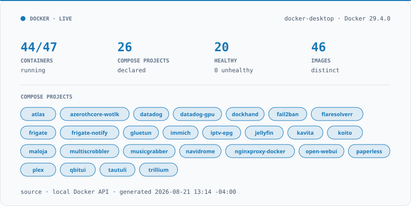

# Docker Homelab

<div align="center">

### Homelab infrastructure, as code

[](https://docs.docker.com/compose/)
[](https://github.com/mwgaillardetz/homelab/actions/workflows/validate.yml)

<picture>
  <source media="(prefers-color-scheme: dark)" srcset="docs/status-dark.svg">
  
</picture>

</div>

Declarative documentation Compose definitions for my Docker
homelab running locally on Docker Desktop.

The committed Compose definitions use environment placeholders instead of
secret values. Secret files, bind-mount contents, and Docker inspect payloads
remain local.
## Current state

- Docker host: local Docker Desktop
- 48 containers across 27 Compose projects
- 45 containers currently running
- Existing definitions: `C:\docker-projects`
- Sanitized Compose definitions: 27 files across 26 public projects

See [the service inventory](docs/inventory.md) and
[architecture](docs/architecture.md).

## Repository layout

```text
apps/                   Sanitized Compose projects
docs/                   Inventory, architecture, and generated status cards
scripts/                Discovery, import, dashboard, and validation helpers
.github/workflows/      Automated validation and security scanning
```

## Refresh generated content

```powershell
./scripts/Export-Inventory.ps1
./scripts/Export-Dashboard.ps1
```

These scripts read Docker metadata only. They never export environment values,
secret values, container logs, or mounted file contents. The `stash` project is
hard-excluded from every generated public artifact.

## Refresh sanitized Compose files

```powershell
./scripts/Import-Compose.ps1
```

The importer discovers active Compose projects from Docker labels, permanently
excludes `stash`, replaces secret-shaped literal assignments with `${VARIABLE}`
references, and creates safe `.env.example` files.

## Validate Compose files

```powershell
./scripts/Test-Compose.ps1
```
