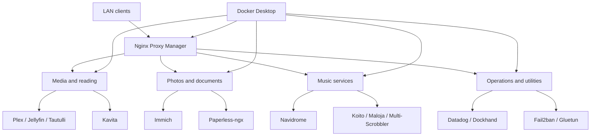

# Architecture

The current host uses independent Compose projects. Docker Desktop provides the
engine, per-project bridge networks isolate most stacks, and Nginx Proxy Manager
is the ingress layer for browser-facing services.

This is a logical view generated from project and service names. Network-level
relationships will be added as stacks migrate into this repository.
